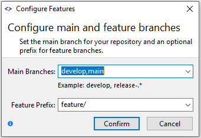

# Feature-Flow

Feature-Flow is a SmartGit development process available only in the Standard Window.

Feature Flow aims to retain the simplicity of adding new features in process such as Git-Flow Light, however Feature-Flow extends the versatility of the process
to accomodate different branch and feature naming conventions that your team may use, and allows multiple trunk branches to be defined.

The main differences of Feature Flow are:
- You need to tell SmartGit which trunk ('main') branches (e.g. `main`, `develop` or `master`) that you will usually be starting new features from.
- Feature flow will ensure that you are up to date with the selected from trunk branch before allowing you to continue.
- If the trunk branch Require that any merge conflicts be resolved, rather than having to resolve them after the new feature has been pushed to the remote and a new pull request opened.
- Local feature branch names are not reserved on the remote when starting features

**Note:**
In this article we refer to 'trunk' branches as any long-lived branch in your repository, such as `main`, `master`, `develop` or release support branches.
On the SmartGit UI, the term 'trunk' branch and 'main' branch are used interchangeably, but note that the concept extends to **any** trunk branch, and there is no requirement to use a branch with the name *main* when using the Feature Flow process.

## Configuring Feature Flow

From the **Branch \| Configure Features** menu option, you can inform SmartGit as to which main / trunk branches you will allow new feature branches to be started from.
More than one trunk branch can be specified, e.g. `main` and `hotfix`.
You can also RegEx patterns, e.g. If you need to support multiple production releases, you, specifying `release-.*` will recgonize branches with names such as `release-1.1`, `release-2.3.4` as trunk branches 
from which hotfixe branches can be created.

**Note** :
The trunk branch identified must exist at the time of setting configuration. When working with a fresh repository, you may need to set up your trunk branch(es) before starting new features.

In addition, you can specify the Feature Prefix to be used on new features. This will default to `feature/`, which is the Git-Flow standard.
You can leave the Feature Prefix blank to remove any prefix from your feature branch names when you start new features.

## Starting a New Feature

**Note:**
Your local repository must be up to date with the remote trunk branch from which you are branching the new feature. If the remote has diverged, you will need to use a command such as pull to 
obtain the most recent commits from your main trunk branch.

After opening a repository from the Standard Window, use the **Start** button on the top ribbon, or select **Branch \| Configure Features**  menu option, and provide the name for the feature.
SmartGit will append the defined Feature Prefix to your feature branch name.
If you have not yet defined any trunk branches for this repository, SmartGit will also prompt you to identify the trunk branch(es) from which you will be creating features.

Once the feature has been started, SmartGit will checkout a branch with the Feature Prefix + name that you have provided, and you can now make the changes needed to the 
Working Tree as needed to implement the feature.

## Integrate

Once you have completed work on the new feature in your Working Tree, use **Integrate** (on the top ribbon, or from **Branch \| Integrate [trunk]** to prepare your feature to be merged into the remote branch named `<trunk>`.

Click the **Integrate** button on the `Local Files` perspective
- If you have unstaged changes, SmartGit will show the `Local Files` subwindow and allow you to stage and commit your changes.
- SmartGit will fetch the remote trunk from which you started the feature
- If the trunk branch from which your local feature has diverged since the feature was started, SmartGit will rebase your feature commits onto the local trunk branch

## Finish

Use Finish to complete your feature, which will push your local feature commits onto the remote trunk from which you started the feature.
By default, SmartGit will attempt to fast forward your feature commits onto the remote branch, however, you do have the option to create a merge commit instead, and provide a commit message for the merge commit.

