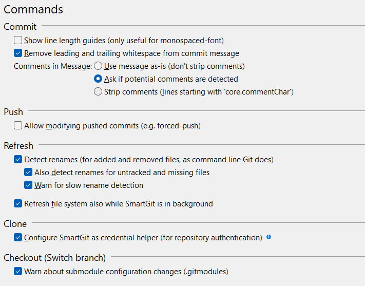

## Commands

This page shows options influencing Git commands executed by SmartGit.

> [!NOTE]
> Some highlighted options require an application restart to be applied.

### Commit

Allows you to configure how commits are handled. 
Here, you can set preferences for commit messages, such as whitespace handling and removal of comments. 

### Push

This allows you to modify a commit that has already been pushed to the remote.

Only select the **Allow modifying pushed commits (e.g. forced-push)** if
you are sure you know Git well enough to understand the consequences of
features such as forced push.

### Refresh

Refresh settings control how your local file system will behave when synchronized from the remote.

With **Detect Renames** enabled, SmartGit will detect renames of
*added*, *removed*, and optionally also *untracked*/*missing* file pairs.

### Clone

If selected, SmartGit will replace the configured `credential.helper` in the `.git/config` of newly cloned repositories. 

Executing remote Git commands (e.g. pull or push) in the terminal or a shell script will then use the credentials known to SmartGit.

**TODO** - The tooltip hint App mentions `For existing repositories that were cloned without the SmartGit credential helper, the setting `Use SmartGit as credential helper` option in **Repository \| Settings**.` But I cannot find this setting?

**Tip:** The `Configure SmartGit as credential helper` setting is recommended if SmartGit is the only GUI client (along with using Git command line) used.
This will simplify the authentication process when accessing platforms like GitHub.
However, if you also use other GUI clients, using the SmartGit credential helper may disrupt the authentication of other GUI tools.

### Checkout

The 'Warn about submodule configuration changes' option provides additional confirmation when working with Submodules (affecting the `.gitmodules` file)
