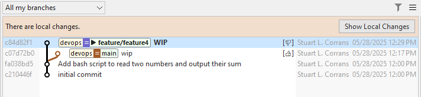

# AI Commit Annotations

SmartGit's AI Annotations are a powerful feature allowing custom extension of the SmartGit's functionality.

Each AI Annotation instructs SmartGit to run a custom AI action, either interactively, or in the background, 
using one or more selected (or inferred) _diffs_ in the commit history as input.

The output of the AI generated annotations can either be displayed interactively on the UI, or linked to the relevant commit(s) using [SmartGit's Notes](Notes.md) capabilities.

Some examples of what AI Commit Annotations can do:
- Describe the contents of a diff, e.g. latest commit on a branch, or the diff between 2 commits.
- Analyze a commit and provide feedback or descriptive metadata about quality factors with the code introduced in the commit.
- Instruct the LLM to generate icons which can be used to augment visualization of Notes.
- As AI annotations can be configured to run in the background, SmartGit can automate checking while you work,
  and the outcome of the AI's response will be added to Git Notes which can be viewed in the **Graph View** of the **Log and Standard Windows**.

## Getting Started

The AI Annotations feature leverages both SmartGit Notes, and the common AI configurations used by all SmartGit features.
It is recommended that you familiarize yourself with these features:

- Please [refer here](../Integrations/AI.md#ai-llm-configuration-options) for instructions on how to connect SmartGit to a LLM.
- [Refer here](Notes.md) for background on SmartGit's Git Notes features.

You add new AI Commit Annotation commands in SmartGit by adding a new [configuration](../Integrations/AI.md) section for each AI-Annotation command that you wish to set up.

Configuration Options include:
- Standard LLM configuration settings.
- The `mode` in which the AI Annotation should run - either _interactively_, showing the output on the UI, or in the _background_, by appending the results to Git notes.
- The prompt that should be executed by the AI when the annotation command is invoked, along with additional context such as the contents of the _diff_ and _commit message_.
- For background annotations:
  - The Notes refs where annotation outputs are to be stored.
  - Any additional Notes processing, such as title, options, and result visualization on SmartGit's **Graph View**.

### Example - Analyzing the difference between two selected diffs and displaying the difference interactively

Adding the below `[ai-commit-annotations]` section to your git config will add a new 'Describe Diff' command to the menu when exactly two commits are selected in **Graph View** of the **Log Window** or the **Standard Window**.

The command leverages an existing LLM configuration called `openai` (tested on `gpt-4.1` on Open AI)

```
[smartgit-ai-llm "openai"]
	type = openai
	model = gpt-4.1
	url = https://api.openai.com/v1
        apiKey = <ApiKey>

[smartgit-ai-commit-annotation "Describe Diff"]
	llm = openai
	maxDiffSize = 131072
	mode = interactive
	diff = pair
	title = Describe Diff
	prompt = Analyze the following Git diff between two commits and summarize the major changes between the commits.\n\
                Do not include the original diff or any reasoning in the response.\n\
                \n\
                ${gitDiff}\n\
```

#### Note
> - With `diff = pair`, if the selected diffs have both diverged from the common ancestor commit, SmartGit will prompt you to select the order of comparison of the diffs.
>   You can swap the order if necessary.
> - A Git diff must be possible between the two commits, e.g. the two commits should have a common ancestor.

### Example - Scanning commits for TODO comments and annotating the commit with a note and an icon

Adding the following `[ai-commit-annotations]` section to your git config will add a new 'Check Todos' command to the menu when a commit is selected in **Graph View** of the **Log Window** or the **Standard Window**.

The same LLM configuration is used as in the previous example.

After saving the configuration, If you run the `Check Todos` AI annotation command, SmartGit will instruct the configured LLM to scan the selected commit for `todo` comments.
An appropriate thumbs up (`👍`) or thumbs down (`👎`) icon will be displayed (in lieu of the usual 'Note' icon), and a Git note will be added to the commit describing the file location(s) of any todo comments found in the commit.



```
[smartgit-ai-commit-annotation "Check For Todos"]
	llm = openai
	notesGraphMessageRegex = ^(.)
	maxDiffSize = 131072
	mode = background
	diff = perCommit
	title = Check Todos
	notesTitle = Todos
	notesRef = todocheck
	prompt = Analyze the following Git diff, and if any TODO comments are found,  \n\
                respond with the the the unicode character U+1F44E. \n\
                List the filename and line number of each todo found. \n\
                If no TODO comments are found, respond with the the the unicode character U+1F44D,  \n\
                and the description "No todos found". \n\
                Do not include the original diff or any reasoning in the response.\n\
                \n\
                ${gitDiff}\n\

```

#### Tips
> - Add a prefix such as `ai/` to the `notesRef` setting to keep a clear distinction between notes generated by AI Annotations and 'standard' [Git Notes](Notes.md).
> - As with other SmartGit AI features, move any common configuration to your global `~/.gitconfig` that you wish to share across all your local repositories,
>   including `smartgit-ai-llm` definitions and reusable `smartgit-ai-commit-annotation` commands.
> - By default, SmartGit sets a small `maxDiffSize` to prevent large commits being sent to LLMs and potentially incurring unwanted expnenses.
>   You may need to increase this setting to suit your needs.
