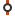
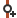
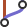
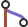
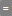
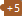

# Graph View

The **Graph** displays the log graph ("history") starting from the selected **Branches** anchors. 
Branches/tags and other *refs* will show up at the "appropriate" commits. 
In case of File (or Subtree) Logs or filtered Logs (see **Filter** input field, below), every *ref* will be mapped to the most recent commit of the graph which is still part of the ref's history. 
In case of File (or Subtree) Logs, the file (or subtree) content of the mapped ref commit will be identical to the content of the actual commit to which the refs points. 
For filtered Logs, when there is no relation between the mapped commit and the actual commit, you will still be able to see which of your filtered commits are part of which ref's history. 
Mapped refs which are not located exactly at the commit to which they are attached will be denoted by `~`.

## Variants of the Graph View

- The **Graph View** is the primary focus of the **Log Window** (Main Window).
  **Query \| Log** - is a shortcut to the **Graph View** in the **Log Window** 
- The **Graph View** in the **Standard Window** is similar, but, as there is no **Branches View**, you only have the option of visualizing the current branch, or all branches, when the 'My History' tab is open.
- The **Journal View** of the **Working Tree Window** shows only the commit history of the current HEAD commmit.

## Display Options

The **Graph** can be customized in many ways from the *Options* hamburger menu `(≡)` above the **Graph View**. 
Not all options are available in all views.
- _Columns_ - Adjust the columns that are shown in the Graph View. 
  Commit SHA id, the date the commit was created, and committer / author can be toggled.
- _Avatar_ - This will either be the author, or committer, depending on the _Columns_ selection above.
  Options include avatar only, initials, full name, and name and email of the author or committer.
- _Show Auxilliary Branch_ (**Working Tree Journal View** only) - Allows the choice one other branch to view in the Journal graph.
- _Show More Commits_ (**Working Tree Journal View** only) - Extends the number of commits at the bottom of the Journal graph.
  This is temporary - when you refresh the Working Tree Window, the original number of commits will be reverted.
- _Show Common Commits_ (**Working Tree Journal View** only) - Toggling this option off hides commits which are not common to the commit history of the Working Tree, and the selected Auxilliary branch.
  This option should only be used when an Auxilliary branch has been selected.
- _Show Branch Labels_ (**Working Tree Journal View** only) - Toggles whether branch labels are displayed.
- _Show only Selected Branches and Tags_ (**Log Window Graph View** only) - Hides branch labels which aren't selected in the **Branches View**.
  

*Graph View in the Log Window, with the Recyclable Commits option enabled*

### Graph filter

Using the **Filter** field above the **Graph**, you can restrict the displayed commits to those matching a certain filter criterion. On change of the **Filter** field, SmartGit will restart the search from the selected **Branches** and report matching commits bit by bit. The search will be performed directly in the repository, so eventually SmartGit will find all matching commits in the entire repository.

## Icons used in the Graph View

The icons in the **Graph View** have the following meanings:

-  - This is the position of the current Working Tree in the commit history. 
  The color of the icon will depend on the state of the Working Tree - e.g. Green if the Working Tree is clean (i.e. no changes since the last commit), Red if there are changes or merge conflicts.
-  - A node icon is shown for each commit displayed in the graph.
-  - Clicking on an expandable Node will show any collapsed commits (typically commits from a second parent branch in a merge commit)
-  - Indicates where a new branch has been created from the node indicated (i.e. the node is a parent to 2 or more separate commits)
-  - Indicates where 2 or more branches have been merged.
  The 'converging' node IS the merge commit.
-  - Indicates that the branch is equal to the tracked upstream branch on the remote (i.e. both branches are at the same commit).
-  - Indicates that the branch is commits ahead (+) or commits behind (-) of the tracked upstream branch on the remote.
-  - Indicates the current position of the tracked upstream branch, when the current branch is commits ahead or behind of it.
  The icons on the current branch position, and the tracked upstream branch on the remote appear as _Broken Puzzle Pieces_. 
-  - Shows the position of the HEAD commit in the graph.

The _Branch Label_ consists of:
- remote name (if applicable)
- branch name
- ahead/behind indicators

