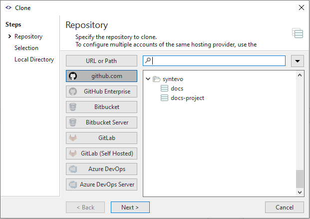

# Integrated Cloning

Once [integration](index.md) with a Hosting Provider has been configured, SmartGit's Clone command will allow navigation to browse repositories available to you on the hosting provider.
The required repository can then be selected and cloned, without needing to copy the Clone URL from the hosting provider and paste it into SmartGit.

SmartGit will display repositories on the Hosting Provider to which it has been granted access, including:
- *user* repositories
- *organization* (org) repositories

#### Example
> In the below diagram, the the SmartGit user has configured integrations to multiple Hosting Providers, and has selected the *Azure DevOps* icon.
> A list of repositories available to the user on Azure DevOps is is displayed beneath each organizational folder:

*** TODO - MERGE FROM GITHUB

### Clone

When [cloning](../GUI/Repository/Clone.md) a repository, you now have the option of selecting your repository from a list, instead of entering a repository clone URL obtained from GitHub.
SmartGit will display your own (*user*) repositories, as well as repositories of your *organization(s)* (*org*).

## Working Tree window

The Working tree window contains a light-weight GitHub integration which shows open incoming pull requests in the title of the **Branches** view.

#### Note

> Detailed pull request information and operations on pull requests are only available in the **Log** (see below).

## Log

In the *Log* window of your repository, you can interact with GitHub in following ways.

### Pull Requests

When initially loading the Log, SmartGit will also refresh information on related *Pull Requests* from the GitHub server:

- **Incoming** pull requests are those which other users are requesting to pull from their repositories. They are displayed in a separate category called **Pull Requests** in the **Branches** view.
- **Outgoing** pull requests are those which you have sent to other users/repositories, requesting them to pull your changes. 
  They are display directly below the local (or if it does not exist), the remote branch in the **Branches** view.

*Incoming* pull requests, in first place, are just present on the server. SmartGit learns about them only by calling a GitHub REST API and displays the retrieved information in the **Branches**. To work with these pull requests (e.g. to review their commits, or **Merge** or **Reject** them), you first have to fetch them by invoking **Fetch** from the context menu of the pull request. This will fetch all commits from the remote repository to a special branch in your local repository and will create an additional, virtual *merge* commit between the *base* commit from which the pull request has been forked and the latest (remote) pull request commit.

When selecting this *merge* node in the **Commits** view, you can see the entire changes which a multi-commit pull request includes and you can [comment](#comments) on these changes, if necessary. After commenting changes, it's probably a good idea to **Reject** the pull request to signal the initiator of the pull request, that modifications are required before you are willing to pull his changes. If you are fine with a pull request, you may **Merge** it. This will request the GitHub server to merge the pull request and then SmartGit will pull the corresponding branch, so you will have the merged changes locally available.

*Outgoing* pull requests can be **Fetch**ed as well, however this is usually not necessary, as the pull request belongs to you and it contains your own commits. If you decide that you want to take a pull request back, use **Reject**.

For a pull request which had been fetched once, there was a special *ref* created which will make it show up in the **Pull Requests** category, even if it is not present on the server anymore. In this case, you may use **Drop Local** on such a pull request to get rid of the corresponding ref, the local merge commit, all other commits of the pull request and the entry in **Pull Requests** as well. It's safe to use **Drop Local**, as it will only affect the local repository and you can re-fetch a pull request anytime you like using **Fetch** again.

You can invoke **Review \| Sync** to manually update the displayed information. 
Usually you will want to do that, if you know that server-side information has changed since the Log has been opened.

To create a pull request, use **Create Pull Request** from the context menu of the **Branches** view.

