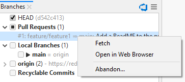
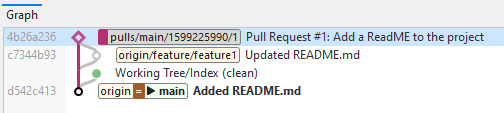
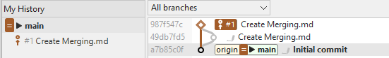
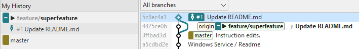

# Integrated Pull Requests

If a repository has been cloned from an [integrated Hosting Provider](index.md), when SmartGit detects changes on the hosting service, 
it will also refresh information on related Pull Requests (PRs) from the remote.

## Creating a Pull Request
After pushing commits to a remote branch, you may want to create a Pull Request on the remote by using the Hosting Provider's custom web user interface.

With integration enabled, SmartGit provides linked shortcuts to create the Pull Request:
- In the **Branch View** of the **Log Window**, by clicking on the pushed branch under the remote folder, OR clicking on the locally tracked branch, and selecting *Create Pull Request*.
- In the **My History View** of the **Standard Window**, by clicking on the pushed branch, and select *Create Pull Request*.
  If you have made commits subsequent to pushing the branch to the remote, SmartGit will prompt you to push the new commits before proceeding with creating the Pull Request.

## Working with Pull Requests in SmartGit
- In the **Standard Window** and **Log Window**, clicking on the Hosting Provider *Icon* will check for new branches and Pull Requests on the remote.
- In the **Standard Window**, if open PR's are present, a hyperlink will be shown taking you to the PR on the *Branches View* of the **Log Window**
- On the **Log Window**, the *Branches View* will show available Pull Requests:

  
  - To work with the PR on the Hosting Provider web site, click on the Pull Request to open the context menu, and select *Open in Web Browser*
  - To work with these pull requests locally in SmartGit (e.g. to review their commits, or Merge or Reject them), the commits in the PR can be fetched by invoking *Fetch* from the context menu of the pull request. 
  This will fetch all commits from the remote repository to a special branch in your local repository and will create an additional, *Virtual Merge Commit* between the base commit from which the pull request has been forked and the latest (remote) pull request commit.
  The virtual merge commit is represented by a diamond icon in the *Graph View* of the **Log Window**.

You can remove the local *Virtual Merge Commit* by using the *Drop Local* command by either clicking on the Pull Request in the *Branches View*, or clicking on the diamond icon in the *Graph View*.

## Reviewing a Pull Request within SmartGit
In addition to using the Hosting Provider's standard Pull Request review features by using *Open in Web Browser*, it is also possible to review Pull Requests directly in SmartGit.

Once a PR has been [fetched](#working-with-pull-requests-in-smartgit), clicking on the *Virtual Merge Commit* in the *Graph View* of the **Log Window** will allow you to view the result of the PR in the *Files View* and the [*Compare View*](../GUI/Compare-View.md) as normal.

In addition, when the repository is integrated to the Hosting Provider, the **Files View** of the **Log Window** will show a [list of comments](Integrated-Comments.md) in the PR.

## Additional Standard Window Functionality (Currently Available on GitHub only)

Additional functionality is available in the **Standard Window** when a repository is [integrated to GitHub](../GitHub-integration.md), and where a PR has been created by you, or assigned to you.
When SmartGit detects that you are involved in a PR, an Icon will be shown in the *My History* area, as well as in the *Graph View*:

- *Incoming* pull requests are those which other users have created and assigned to you.
  On the commit, the icon below displayed, along side the hosting provider's PR reference identifier.

- *Outgoing* pull requests are those which you have initiated to other users/repositories, requesting them to merge your changes.
  On the commit, the icon below is displayed alongside the hosting provider's PR reference identifier.
  

## Additional features in the Working Tree window

The Working tree window contains a light-weight GitHub integration at the top of the **Branches** view:
- A *Pull Requests* link which will take you to the **Log Window**, where the PRs will be shown.
- An icon showing the Hosting Provider connected to this repository. Clicking on the Icon will refresh the state of remote branches and pull requests.

#### Note

> Detailed pull request information and operations on pull requests are only available in the **Log** (see below).

## Log Window

In the *Log* window of your repository, you can interact with GitHub in following ways.

To create a pull request, use **Create Pull Request** from the context menu of the **Branches** view.

### Pull Requests

When initially loading the Log, SmartGit will also refresh information on related *Pull Requests* from the GitHub server:

## Technical note on the Synchronization between SmartGit and Pull Requests on the remote Server

*Incoming* pull requests, in first place, are just present on the server. SmartGit learns about them only by calling a GitHub REST API and displays the retrieved information in the **Branches**. To work with these pull requests (e.g. to review their commits, or **Merge** or **Reject** them), you first have to fetch them by invoking **Fetch** from the context menu of the pull request. This will fetch all commits from the remote repository to a special branch in your local repository and will create an additional, virtual *merge* commit between the *base* commit from which the pull request has been forked and the latest (remote) pull request commit.

When selecting this *merge* node in the **Commits** view, you can see the entire changes which a multi-commit pull request includes and you can [comment](#comments) on these changes, if necessary. After commenting changes, it's probably a good idea to **Reject** the pull request to signal the initiator of the pull request, that modifications are required before you are willing to pull his changes. If you are fine with a pull request, you may **Merge** it. This will request the GitHub server to merge the pull request and then SmartGit will pull the corresponding branch, so you will have the merged changes locally available.

*Outgoing* pull requests can be **Fetch**ed as well, however this is usually not necessary, as the pull request belongs to you and it contains your own commits. If you decide that you want to take a pull request back, use **Reject**.

For a pull request which had been fetched once, there was a special *ref* created which will make it show up in the **Pull Requests** category, even if it is not present on the server anymore. In this case, you may use **Drop Local** on such a pull request to get rid of the corresponding ref, the local merge commit, all other commits of the pull request and the entry in **Pull Requests** as well. It's safe to use **Drop Local**, as it will only affect the local repository and you can re-fetch a pull request anytime you like using **Fetch** again.

You can invoke **Review \| Sync** to manually update the displayed information. 
Usually you will want to do that, if you know that server-side information has changed since the Log has been opened.

